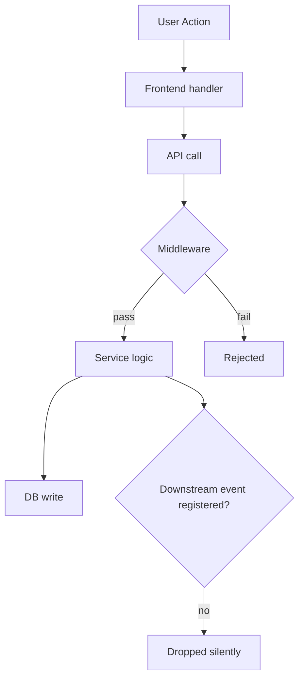

# DEBUGGING & CODEBASE AUDIT — Universal Protocol
Compatible: Small models (0.8B+) → Frontier models (Opus / GPT-4o)

## Contents

1. [Reference Files](#reference-files-load-only-when-needed)
2. [Global Rules](#global-rules)
3. [Mode Selection](#mode-selection)
4. [Audit Mode](#audit-mode)
5. [Fix Mode](#fix-mode)
   - [Before You Start](#before-you-start) — how to read gates, the confidence trap, report formats, human-input rules
   - [Flow Map](#flow-map) — master flow + symptom shortcuts + Live/Temporal classification
   - [The Gates (0–10)](#gate-0--is-this-a-bug-report)
   - [Cross-Cutting Rules](#cross-cutting-rules) — evidence standard, enforcement checkpoints, edge cases
6. [Gate Cheat-Sheet](#gate-cheat-sheet)

---

## Reference files (load only when needed)
- `references/example.md` — Full end-to-end walkthrough (auth redirect bug, Gates 0–10)
- `references/glossary.md` — Definitions for all terms and status symbols
- `references/antipatterns.md` — Anti-patterns P1–P10 with recognition signs and correct actions
- `references/patterns.md` — Root-cause pattern library (incomplete refactor, architectural mismatch, config drift, cache invalidation...), common gotchas, and keyword banks by domain (auth, notifications, payments, queues...)
- `references/fix-proposal-template.md` — Structured multi-service/multi-file fix-proposal format (services table → files-and-layers table → unified-diff code changes) for Gate 9A, when a fix is too large for the plain CHANGE LOG
- `references/changelog.md` — Version history

Load a reference file only when you need it. Do not load all of them upfront.

---

## GLOBAL RULES
Apply in both modes, every session, regardless of LITE/FULL track (see Gate 0B).

- **Bilingual reporting is scoped, not universal.** Exactly three things must be written in **both Thai and English** (Thai first, English restatement directly under — or side-by-side, whichever reads cleaner): (1) Gate 8B's ROOT CAUSE statement, (2) Gate 9's proposed fix, (3) the AUDIT MODE final report. Nothing else needs to be bilingual — GATE REPORTs, matrices, provenance checks, and every other internal template stay in whichever single language you're already reasoning in. Don't over-apply this to internal working notes; it exists so the *user-facing conclusion and the fix proposal* are never lost in translation, not to double the length of every gate.
- **Never modify code before explicit approval.** Root cause → proposed solution(s) go in chat first. Do not run Gate 9A (apply the fix) until the user has replied with actual approval — silence, a "yes" to an unrelated earlier question, or you being confident the fix is right do not count.
- **Never run `git restore` (or any other destructive git command — `checkout --`, `reset --hard`, `clean -f`) without asking the user first, in the moment, even if a fix requires reverting a file.** State exactly what you want to revert and why, wait for explicit consent, and only then run it.

---

## MODE SELECTION
Read this first, every time. This skill has two modes — pick one before doing anything else.

```
FIX MODE — something is broken and the user wants it working again.
  Signals: "doesn't work", "broken", "error", "crash", "used to work",
           a stack trace, a reproduction scenario, "fix this".
  → Run the full GATE 0–10 flow below. Ends with a verified, root-caused fix.

AUDIT MODE — the user wants to understand, trace, or map something.
  No fix is expected yet — output is a report, not a code change.
  Signals: "audit X", "trace how Y flows", "which files handle Z",
           "why doesn't X work" asked as a curiosity/investigation
           (not "please fix it now"), "investigate", "map the data flow".
  → Skip straight to AUDIT MODE section (after this table). Do not run
    the fix-oriented gates (browser testing, fix checkpoints, etc.)
    unless the audit surfaces something the user then asks you to fix —
    at that point, switch to FIX MODE from GATE 6 onward (you already
    have the layer map and file list from the audit).
```

If genuinely ambiguous, ask: "Do you want me to just investigate and report back, or find and fix the bug?"

---

# AUDIT MODE

Use when the deliverable is understanding, not a code change. Depth is chosen once, up front, then executed without further interruption.

### A1 — Ask once (skip only if the user already answered all four)

```
Before I start the audit, I need 4 things:

① OBJECTIVE — What exactly do you want to understand?
② CODEBASE PATH — Where's the root? (default: current directory)
③ DEPTH — choose one:
   [1] Surface   — File discovery only. Which files are involved?
   [2] Standard  — Read key files + trace the main logic flow end-to-end.
   [3] Deep      — Full cross-layer analysis (FE + BE + DB + Infra + Config).
   [4] Forensic  — Deep + edge cases, race conditions, config drift, hidden deps.
④ OUTPUT — chat report, or saved to a file? Include a Mermaid diagram?
```

Use an interactive widget if the platform has one; otherwise send this as one plain-text message and wait for the reply.

### A2 — Map the codebase, then search

```bash
find <root> -maxdepth 2 -type f | head -80
cat <root>/package.json 2>/dev/null || cat <root>/requirements.txt 2>/dev/null || \
  cat <root>/go.mod 2>/dev/null || cat <root>/Cargo.toml 2>/dev/null
```

Identify layers present: Frontend (`src/`, `app/`, `components/`), Backend (`api/`, `routes/`, `services/`), Database (`models/`, `migrations/`, `prisma/`), Infra (`docker-compose.yml`, `.env*`), Jobs (`jobs/`, `workers/`, `cron/`).

Then extract 3–5 keywords from the objective and grep for them. See `references/patterns.md` for a keyword bank by domain (notifications, auth, follow/social, email, queues, payments, uploads, search) if the objective maps to one of those.

Compile the **Relevant File List**, grouped by layer, each with a one-line reason. This list is always included regardless of depth.

### A3 — Execute the chosen depth

**[Surface]** — File list + one-sentence role per file + 2-3 sentence guess at where the issue lives. Don't read file contents in depth.

**[Standard]** — Read each relevant file. Trace the happy path end-to-end (entry point → handler → downstream calls → final effect). Identify the first gap: the earliest point where expected behavior doesn't occur or isn't implemented. Output: numbered audit trail + gap.

**[Deep]** — Read all relevant files across all layers. Check each layer for issues (frontend: dispatched correctly? errors swallowed? / backend: route registered? middleware blocking? / service: conditional dispatch, feature flags? / DB: schema support, FKs, indexes? / queue: enqueued? worker running? retries? / config: env vars present, credentials valid?). Note every cross-layer handoff and whether it's intact. Generate ranked root-cause hypotheses with confidence scores and cite evidence (`file:line`) for each — see `references/patterns.md` for the common root-cause pattern library (incomplete refactor, architectural mismatch, layered redundant logic, config drift, cache/state invalidation) to check against.

**[Forensic]** — Everything in Deep, plus: read every conditional in relevant files for silent suppression paths; look for race conditions (async without await, missing locks); diff `.env.example` vs actual `.env` for config drift; check for feature flags / role guards / tenant settings that could suppress behavior; note dead code and stale references; verify required infra (queues, workers, external APIs) is actually configured to run.

### A4 — Report

```markdown
# Codebase Audit Report
**Objective**: ...  **Depth**: ...  **Codebase**: ...

## 1. Relevant Files (grouped by layer, with reasons)
## 2. Data / Event Flow (Mermaid, if requested)
## 3. Audit Trail (numbered steps, Standard+)
## 4. Root Cause Hypotheses (ranked, confidence %, Deep+)
## 5. Recommended Next Steps
```

Mermaid template:


If the user then asks you to fix what the audit found: you already have the Relevant File List and (if Deep+) the layer map — go to **GATE 6** below with that context pre-filled, rather than restarting from Gate 0.

---

# FIX MODE

## Before You Start

### How to read this section

Decision-first format. Every gate: a condition (`IF [situation]`), an exact action (`→ DO [this]`), a required output (`OUTPUT: [template]`). Fill templates exactly — don't paraphrase them. Don't skip a gate because the answer seems obvious.

### The confidence trap

When you read a bug description and think "I know what this is," that's a signal to slow down. The fix that feels obvious comes from pattern-matching code structure, not from observing runtime behavior — and that gap is where bugs live.

**Recognise these as traps, not conclusions:** "The problem is clearly X" · "I can see the issue in the code" · "This is the same bug I've seen before" · "Let me just fix it and see."

**Correct response:** write the confident answer down as H1 in Gate 7, confirm it with runtime evidence in Gate 8, then fix. If you're right, this costs 5 minutes. If you're wrong — which happens more than it feels like it will — this saves an hour.

### Gate report format — mandatory after every gate

Post one of these after completing each gate, before moving on — pick per the Gate 0B track. Neither form allows abbreviating real evidence into a paraphrase or a "see above."

**FULL** (default; also use for any single gate a LITE run escalates on):
```
═══════════════════════════════════════════════════════
GATE [N] — [GATE NAME]  ·  STATUS: [✅ COMPLETE | ⚠️ BLOCKED | ❌ FAILED]
═══════════════════════════════════════════════════════
WHAT I DID       [every action taken, one per line, min 3 lines — not "I completed the gate"]
WHAT I FOUND     [actual output/evidence, quoted directly — never paraphrased]
GATE RESULT      [the filled output template from this gate, not a prose summary]
NEXT STEP        [exactly which gate comes next, and why — or what's blocking]
═══════════════════════════════════════════════════════
```

**LITE** (gates classified LITE at Gate 0B):
```
GATE [N] [NAME] → FOUND: [actual evidence, still quoted not paraphrased] → NEXT: [gate + one-line reason]
```
If a LITE gate turns up something bigger or more ambiguous than expected, escalate that gate to FULL and say so — don't force a one-liner over something that genuinely needs a table.

### Interactive input

If the platform has an interactive widget, prefer it for any bounded-choice question (yes/no, pick from a list, classify RELATED/UNRELATED/BLOCKING). Batch related questions into one call. Fall back to plain prose only for genuinely open-ended questions ("paste the error", "what changed").

### Gates requiring human input — no exceptions

```
Gate 1B | 🛑 WAIT | Show ENV result. Confirm before any command.
Gate 1D | 🛑 WAIT | Docker permission + rebuild policy, asked once.
Gate 2B | 🛑 WAIT | Ask permission before opening a browser.
Gate 4  | 🛑 WAIT | Every ? cell needs a user test result.
Gate 9B | 🛑 WAIT | User confirms each scenario result before gate closes.
Gate 10 | AUTO+WAIT | Run integration check yourself; wait for scope review.
All others (0,1A,2A,3,6,6B,6C,7,9A) | AUTO | Do this yourself, don't ask.
```

---

## Flow Map

### Master flow

```
GATE 0   → Is this a bug report? (if not → AUDIT MODE or respond normally)
GATE 0B  → Classify LITE or FULL (decides ceremony level for everything below)
GATE 1   → Backend / container check
GATE 2   → Evidence collection (browser, if UI symptom)
GATE 3   → Build Symptom Matrix
GATE 4   → Fill all matrix cells
GATE 5   → Find the Delta (+ classify Live vs Temporal)
GATE 6   → Build System Layer Map
GATE 6B  → File Provenance Check (every file, every time)
GATE 6C  → Impact Perimeter Map (before modifying any confirmed file)
GATE 7   → Generate Hypotheses
GATE 8   → Diagnose with runtime evidence (not code reading)
GATE 8B  → Root Cause Drill — 5-Why until bedrock
GATE 8C  → Debug Thread Register (new errors appearing mid-session)
GATE 9   → Propose fix (chat, bilingual) → wait for approval → Apply → Fix Checkpoint
GATE 10  → Integration Verification + Root Cause Scope Check
```

Never skip ahead. Never combine gates. Complete the OUTPUT before moving on.

### Quick-Route — symptom-based gate shortcuts

Use these to jump into the flow faster when the symptom is already well-characterized — but still produce every gate's OUTPUT once you arrive there, and still complete Gates 6B/6C before touching any file.

| Symptom | Jump to | Why |
|---|---|---|
| Broke right after a known code change | Gate 6 (build layer map around that change), then Gate 7 | You already know the delta; skip straight to hypothesis on that diff |
| Intermittent / random failures | Gate 5, classify as **Temporal** (below) | Timing/concurrency — needs multi-run evidence, not single-shot |
| Works locally, fails in Docker | Gate 1 (env) + Gate 6 (config/env layer) | Environment mismatch is the default suspect |
| Works for user_a, not user_b | Gate 3, axis = user/role/state | Per-entity state or permission mismatch |
| Same error N times per session | Gate 5, classify as **Temporal** | Recurring pattern → race condition, not one-off |
| API errors with no explanatory logs | Gate 8 diagnostic plan | Add logs at the actual decision points before guessing |
| DB value wrong but code looks right | Gate 8, trace each transform step | Log at every point data is written or reshaped |
| A confirmed-correct condition/bypass still doesn't produce the expected outcome | Gate 6C — widen the grep past the one symbol already suspected | Suspect a second handler/middleware/decorator doing the same job elsewhere in the app-assembly path, registered under a different name |
| Fix applied, re-run shows byte-identical failure (same message, same numbers) | Gate 9B — confirm the changed file is actually live in the tested environment before touching logic again | Identical output after a real code change usually means stale build/container/cache, not a wrong fix |

### Live vs Temporal bug classification (do this at Gate 5)

```
LIVE     — same action → same failure every time. Direct search + single log run confirms it in 1-2 test runs.
TEMPORAL — same action → sometimes works, sometimes fails. Needs 10+ runs, timestamped logs
           (`[EVENT] Point A: ${Date.now()}`), and a probability-based hypothesis approach.
```

Ask: "Does this always happen, or sometimes?" — this determines how many runs Gate 4/8 need before you can trust the evidence.

---

## GATE 0 — Is this a bug report?

ACTIVATE if: something used to work but doesn't; an error/crash/unexpected output was reported; a specific scenario behaves incorrectly; the user wants a specific runtime discrepancy fixed.

DO NOT activate for: new features, code review, "how do I implement X", explaining an error in the abstract, architecture discussions with nothing broken. Route those to **AUDIT MODE** if there's still something to trace/understand, or just respond normally.

## GATE 0B — Classify Complexity: LITE or FULL

Pick a track before doing anything else — it decides how much *ceremony* the rest of the gates need. It never touches the *discipline*: runtime evidence before calling anything confirmed (Gate 8), file provenance before modifying an unconfirmed file (Gate 6B), and propose→wait→approve before applying a fix (Gate 9) are non-negotiable on both tracks. LITE only compresses formatting and exhaustiveness — not evidence.

```
LITE — all of these are true:
  - Fix will plausibly touch ≤2 files
  - You already know which single layer/service is involved (no cross-service ambiguity)
  - Bug is reproducible on demand (Live, not Temporal — Gate 5 classification)
  - Not touching auth, payments, production data, or anything where a wrong fix is expensive
  → Use the LITE GATE REPORT format and every template marked "LITE:" below.

FULL — anything else, OR a LITE attempt that didn't reach a confirmed root cause in one pass.
  → Use the full templates as written throughout this document.
```

If unsure, start LITE and escalate the moment a FULL trigger shows up mid-investigation (turns out cross-layer, can't reproduce reliably, fix balloons past 2 files, touches something expensive to get wrong). Announce the escalation in one line — don't switch silently, and don't downgrade back to LITE mid-investigation once you've escalated.

## GATE 1 — Backend / Container Check

**Trigger:** API, database, server logic, auth, or any backend component is involved. If frontend/UI only → skip to Gate 2.

### 1A — Inspect project files yourself (don't ask yet)

Read, in order, stopping at the first that answers "local or container?": `docker-compose.yml(.override)`, `Dockerfile`, `Makefile`, `package.json`/`Pipfile`/`pyproject.toml` scripts, `.env*`, `README.md`.

Extract exact service names, DB service/image, `DB_NAME`/`DB_USER`. **Never guess** a name like `app`/`db`/`backend` — only use what a file literally says.

```
ENV DETECTION RESULT
Run mode: [Local | Docker Compose | Unknown]   Detected from: [file, section]
Services: [exact names] → [image] → [role]
Database: service=[...] engine=[...] DB_NAME=[...] DB_USER=[...]
Unknown fields: [list]
```

### 1B — 🛑 Confirm with user before any command
Show the ENV DETECTION RESULT. Ask "Is this correct? Is it currently running?" Do not run anything until confirmed.

### 1C — Container command rules (apply for all subsequent gates)

Safe, run freely: `docker compose ps|logs|exec|restart` (no rebuild).

**LOCKED — never run without explicit written approval at the moment you need it** (an earlier "yes" doesn't count): `docker compose build`, `up --build`, `down`, `down -v`, `system prune`, `pip/npm install`, migrations, seed/reset commands. Rebuilding changes the environment you're debugging — if the bug disappears after a rebuild you can't tell if your fix worked or the rebuild changed something else.

Before every `docker exec`: run `docker compose ps` first, use only the container names it actually reports. Before every DB query: confirm `current_database()`/`current_user` matches the ENV DETECTION RESULT before trusting results.

### 1D — 🛑 Docker session config (ask once)

Ask (interactive tool if available): (1) what you're allowed to do with Docker this session — full-auto / read-only-auto / ask-each / user-runs-everything, and (2) rebuild policy — user-rebuilds / auto-rebuild / no-rebuild. Store as SESSION CONFIG, apply it silently for the rest of the session (don't re-ask).

If a rebuild is needed under `user-rebuilds`: announce exactly what and why *before* asking the user to run it, state what you'll do immediately after, wait for explicit "rebuild complete" confirmation, then proceed exactly as announced.

**If the platform's approval prompt itself times out with no reply:** that is not consent. A LOCKED action (rebuild, `up --build`, migrations, etc.) still requires an explicit answer — if your harness auto-resumes and lets you "decide for yourself" after a timeout, treat that the same as an unanswered question: do not take the LOCKED action, state clearly that you're blocked pending approval, and re-ask rather than proceeding on your own judgment.

### Edge cases
No compose file but a Dockerfile → ask how it's started. Multiple compose files → ask which. `.env` missing/gitignored → ask for `DB_NAME`/`DB_USER`/service name, never guess. Suspected Kubernetes → ask for context/namespace, don't attempt `docker exec`.

## GATE 2 — Evidence Collection (Live Browser + Infra)

**Trigger:** bug has a visible UI symptom, or you need live runtime evidence (network requests, console errors, DOM state) rather than static code reading.

**2A (auto):** check silently which live-evidence tools exist in your tool list, in this preference order: **Chrome DevTools MCP** (`mcp__chrome-devtools__*` or similar — gives you Network/Console/Performance/DOM inspection on a real Chrome instance) → Playwright MCP → any other browser-automation tool → none.

**2B — 🛑 if a live browser tool exists:** ask permission before opening it (what you'll do, yes/no, credentials if login is required). If declined or unavailable → **Path B**.

**Path A (approved live browser tool):** Collect base URL, login details/credentials, navigation path, expected working state, expected broken state — ask only for what's missing. Write a **TEST PLAN** (numbered scenarios with expected outcome) and get it confirmed before touching the browser. Execute one scenario at a time, mark ✅/❌/⚠️, and for each capture whatever the tool exposes: Console errors, failed/slow Network requests (status code, payload, timing), and DOM/element state — not just "it looked broken." Stop and ask before clicking anything unexpected (modal, captcha, unclear button). Show **BROWSER TEST RESULTS** and get confirmation before Gate 3.

**Path B (no live browser tool):** Write a **MANUAL TEST SCRIPT** — one action per step (not "log in", but "type email in Email field, click Sign In"), max 5 scenarios, always include one baseline (should work), always ask for console errors on failures. Wait for results; don't hypothesize until you have at least one ✅ and one ❌.

### 2C — Infra/deployment escalation (if live-test + Docker evidence is still insufficient)

If the app is deployed on Railway (or the local Docker evidence from Gate 1 doesn't explain what the live test just showed — e.g. a 502, an env var that should exist but doesn't behave like it's set, a service that won't come up) invoke the **`use-railway`** skill before guessing further. Use it to pull deploy logs, service status, and environment variables from the actual running environment rather than assuming local config matches production. Treat whatever it returns as runtime evidence (Gate 8), not as a substitute for confirming the file/layer that's actually in the failing path (Gate 6B still applies).

If insufficient evidence remains after both the live test and the Railway check, say so explicitly and ask the user for the missing piece — don't proceed to Gate 3 with unfilled gaps disguised as conclusions.

## GATE 3 — Build Symptom Matrix

Pick two axes (entry method / user role / environment / data state, etc.) and fill a table with ✅/❌/⚠️/`?`.

```
SYMPTOM MATRIX
              | [Axis B: opt1] | [Axis B: opt2] | [Axis B: opt3]
[Axis A: opt1]|       ?        |       ?        |       ?
[Axis A: opt2]|       ?        |       ?        |       ?
```

**LITE:** if the bug is Live and reproducible via one clear scenario, skip the 2-axis table — write one line: `Repro: [working case] vs [failing case]`. If that single comparison doesn't cleanly explain the delta in Gate 5, escalate to the full matrix rather than guessing.

## GATE 4 — 🛑 Fill All Unknown Cells

Ask the user to test each `?` cell specifically. **Hard rule:** never diagnose until you have at least one ✅ AND one ❌ — an all-❌ matrix tells you nothing about the mechanism. (LITE's one-line repro already satisfies this if it names a working case and a failing case.)

## GATE 5 — Find the Delta

```
DELTA ANALYSIS
PASSING scenario : [cell] — what happens technically: [...]
FAILING scenario : [cell] — what happens technically: [...]
DELTA (exact difference): [...]
BUG TYPE: [Live | Temporal — see Quick-Route classification above]
```

If you can't name the delta → go back to Gate 4 and collect more cells. Every hypothesis in Gate 7 must explain this delta.

## GATE 6 — Build System Layer Map

```
SYSTEM LAYER MAP
Layer            | Component name(s)    | Status
Frontend         | [...]                 | ? uninspected
AppProvider/ctx  | [...]                 | ? uninspected
Proxy/middleware | [...]                 | ? uninspected
API              | [...]                 | ? uninspected
Backend logic    | [...]                 | ? uninspected
Database         | [...]                 | ? uninspected
```

Every layer the request travels through gets a row — never omit or assume-fine an unknown layer. Status values: `? uninspected` → `✓ verified OK` → `✗ confirmed issue` → `~ partially fixed`. This map is never discarded or shrunk — update it as you go.

**LITE:** if only one layer is plausibly involved, skip the table — state it in one line, e.g. `Layer: frontend only — FollowButton.tsx`. The moment a second layer turns out to matter, switch to the full table (that's a FULL escalation trigger).

## GATE 6B — File Provenance Check

Run for EVERY file before reading it diagnostically, and again before modifying it — even if the user is confident about which file it is (user confidence ≠ evidence).

```
FILE PROVENANCE CHECK
File: [path]   Mentioned by: [user | stack trace | code reading | log output]
Q1. In the request path for the failing scenario? Evidence: [...or "not yet confirmed"]
Q2. Confirmed executing during the failure? Evidence: [...or "not yet confirmed"]
Q3. Does the Gate 5 delta point to this layer? [yes/no/unclear + reason]
VERDICT: [CONFIRMED IN PATH | UNCONFIRMED — do not modify yet]
```

If UNCONFIRMED: don't read it for clues or modify it. Cheapest confirmation: add a log at its entry point, reproduce, check output.

**LITE:** condense to one line per file — `[path] — provenance: [how confirmed] → CONFIRMED/UNCONFIRMED`. You're compressing the write-up, not skipping the check: still answer Q1–Q3 in your head before writing the line, and still refuse to touch an UNCONFIRMED file.

## GATE 6C — Impact Perimeter Map

**Trigger:** a file passed Gate 6B and is about to be modified.

Run first, record output:
```bash
grep -rn "functionName\|ClassName" --include="*.ts" --include="*.tsx" --include="*.js" .
grep -rn "from.*filename\|require.*filename" --include="*.ts" --include="*.tsx" --include="*.js" .
```

**Duplicate-implementation check** — if the symptom is "a condition/bypass is confirmed correct but the bad outcome still happens," the usual grep above (searching for the one symbol you already suspect) will miss a second implementation of the same responsibility under a different name. Also grep for the *symptom itself* — the literal error code/string/status the user sees — across the whole app-assembly/registration path (e.g. every `add_middleware(`, every route registered on the same path, every place a distinctive error string appears), not just the file already in front of you:
```bash
grep -rn "429\|RateLimit\|add_middleware(" --include="*.py" .   # example: duplicate middleware
```
This is what actually catches "two handlers doing the same job" — searching by symbol name alone only finds callers of the thing you already know about.

```
IMPACT PERIMETER MAP
File to modify : [...]   Planned change : [...]
Callers (from search): [list, or "none — confirmed by 0 grep results"]
Dependents: [list, or "none"]
Shared state (cache/session/DB/global): [resource + other readers/writers, or "none"]
Related paths (same pattern elsewhere): [path — same fix needed? y/n/unknown]
PERIMETER VERDICT: [Isolated → proceed | Has dependents → fix ALL this session | Unknown scope → clarify first]
```

"I'll fix callers later" is not allowed — that's piecemeal debugging, the exact failure mode this skill exists to prevent. If dependents or related paths are found, add each as a new matrix scenario and fix them together.

**LITE:** condense to one line — `[path] — perimeter: [N callers via grep] → Isolated/Has dependents`. Still actually run the grep; you're compressing the report, not the check. Finding dependents is itself a FULL escalation trigger (fix touches >2 files).

## GATE 7 — Generate Hypotheses

Generate 2-4. Each names a layer, a root cause, and explains the Gate 5 delta. Consult `references/patterns.md` for the common root-cause pattern library (incomplete refactor / architectural mismatch / layered redundant logic / config drift / cache invalidation) — matching a known pattern speeds this up but still needs Gate 8 confirmation.

```
HYPOTHESES
H1: [Layer] — [Root cause] — delta explained: [mechanism]
H2: [Layer] — [Root cause] — delta explained: [mechanism]
H3: [Layer] — [Root cause] — delta explained: [mechanism]
```

If all hypotheses point to the same layer → red flag. Add one from a different layer. These are unconfirmed — say "suspect", not "the bug is".

**LITE:** 1-2 hypotheses inline is fine when the Gate 5 delta already strongly points to one layer — no need to force a 3-row table for a bug that's obviously in one place.

## GATE 8 — Diagnose With Runtime Evidence

```
CODE READING   → hypothesis (not evidence)
RUNTIME OUTPUT → evidence: log lines from the failing run, stack traces, network
                 request/response, test assertion (actual vs expected), live DB
                 query result, console output from a temp debug statement.
```

For each hypothesis, design one check that produces runtime output. Run the cheapest first (log line > network trace > test > DB query). Stop after one is confirmed by actual output. Mark ambiguous results ⚠️ — never fix on an unconfirmed hypothesis.

**Branch probes go inside the branch, not before it.** A log/print placed *before* an `if`/`else` only proves what value was evaluated — it does NOT prove which branch actually executed. Treating "I logged the input and it looked right" as proof the expected branch ran is itself disguised code reading. When the hypothesis is about which branch fires, put a distinct probe inside *each* branch (e.g. right before that branch's `return`), so the evidence names the branch taken, not just the input to the decision.

**Don't retry a failed diagnostic technique a third time.** If the same command/approach (not just the same layer) fails or times out twice in a row, stop — switch technique (shorter script, different tool, ask the user) rather than attempting it a third time in the same form. This applies during Gate 8 diagnosis itself, not just to the post-fix "don't re-examine the same layer twice" rule in Gate 9C.

```
DIAGNOSTIC PLAN
H1 check: Action: [...] Output to collect: [...] Confirms if: [...] Rules out if: [...]
H2 check: Action: [...] Output to collect: [...] Confirms if: [...] Rules out if: [...]
```

**Evidence validity checklist before writing the GATE REPORT** — all must be YES: did I actually run something (not just read code)? do I have literal output to paste? does it directly show the failing behavior at runtime? is "confirmed" based on that output, not code structure? If any is NO, go collect the missing evidence — don't write "confirmed".

**Disguised code reading** (looks like evidence, isn't): "SCHEMA VERIFIED: backend returns X" (reading a schema file), "Code shows no ownership check" (reading + opinion), "Frontend correctly accesses response.items" ("correctly" from reading, not observing), writing "ROOT CAUSE:" inside a Gate 8 report (that's Gate 8B's job), "debug log confirms the input was X, so the bypass branch ran" (a probe *before* the branch only proves the input — not which branch executed; see the branch-probe rule above). The test: can you paste the exact output that proves it? If not, it's code reading.

## GATE 8B — Root Cause Drill (5-Why)

**Trigger:** a hypothesis is confirmed by runtime evidence — it may still be a symptom one level deep.

```
5-WHY DRILL
Confirmed finding: [runtime evidence]
Why does that happen? → [...]
Why does THAT happen? → [...]
Why does THAT happen? → [... — ROOT CAUSE if directly fixable, else keep drilling]
ROOT CAUSE: [last answer] Type: [missing config | wrong value | absent code | incorrect logic | wrong dependency]
Fix target: [exact file, line, config key, or query]
```

Bedrock test: "Is there a deeper reason this cause exists?" If yes, keep drilling. "Error 404", "returns null", "query fails" are never root causes on their own — keep asking why.

Fewer than 5 whys is fine the moment the bedrock test passes — 5 is a ceiling for stubborn bugs, not a quota every bug must hit. Most LITE-track bugs bottom out in 1-2 whys; that's a correctly-run drill, not a shortened one, as long as the bedrock test actually passed.

Once bedrock is reached, present the ROOT CAUSE to the user in **Thai + English** (see Global Rules) before moving to Gate 9 — this is the "Generate Root Cause Explanation in Chat" step, and it happens here, not folded silently into the fix.

## GATE 8C — Debug Thread Register

**Trigger:** a new error/symptom appears mid-session.

```
NEW ITEM: [error/symptom]   Classification: [RELATED → branch current 5-why, stay on thread |
UNRELATED → log to DEFERRED ITEMS, stay on thread | BLOCKING → fix minimum to unblock, return to thread]
```

Present all DEFERRED ITEMS at Gate 10 close — never discard silently.

## GATE 9 — Propose → Approve → Apply → Fix Checkpoint

### 9A — Propose the fix (do NOT modify code yet)

One root cause per fix cycle. Multiple files are fine only if all are within the Gate 6C perimeter for *this* root cause — never bundle unrelated improvements or refactors. If more than one viable fix exists, propose the options — don't silently pick one.

```
CHANGE LOG — Fix #[N]  (PROPOSAL — nothing applied yet)
Root cause being fixed: [from Gate 8B]
Files to modify: 1. [path] — change: [what and why]   2. [path] — [...] (only if in perimeter map)
Files NOT in this fix: [tempting but out of scope]
Attribution test: if this fix alone is reverted, does the symptom return? [yes → properly scoped | no → split it]
```

Post this proposal in **Thai + English** (see Global Rules) and stop. **🛑 Wait for explicit user approval before touching any file** — this is the "wait for user to inspect and approve solutions" step. A reply that isn't a clear approval (a question, silence, "looks reasonable" without a yes) is not approval — ask directly: "Approve this fix? (yes/no/change something)".

Once approved, apply exactly what was proposed. If applying it requires reverting or discarding existing changes (`git restore`, `checkout --`, etc.), that needs its own explicit ask per Global Rules even though the fix itself was already approved.

**LITE:** the CHANGE LOG can collapse to one or two lines for a genuinely single-file, few-line fix. The bilingual proposal, the explicit wait-for-approval, and the Attribution Test question are never skipped on either track.

**Multi-service / multi-file fixes:** when the fix spans several services or more than a handful of files, use the heavier structured format in `references/fix-proposal-template.md` instead of the CHANGE LOG above — services table → files-and-layers table per service → unified-diff-style code changes with inline notes. This is a presentation format for the same Gate 9A content (root cause, files, why), not a different gate; it still needs the bilingual root cause from Gate 8B above it, and it still stops for approval before Gate 9's "apply" step.

### 9B — 🛑 Fix Checkpoint (mandatory after every fix)

Re-run the Symptom Matrix, checking every cell that was ❌.

```
FIX CHECKPOINT
Fix applied: [layer + change]
[Scenario]: was ❌ → now [✅ / still ❌]
All resolved? [YES → Gate 10 | NO → 9C ZOOM OUT]
```

**Before treating a still-❌ result as "the fix was wrong":** compare the failure output to the pre-fix failure output. If they are **byte-identical** (same message, same numbers, not just the same category of error) after a real code change, do not jump straight to a new logic hypothesis — first confirm the edited file is actually the one that ran (correct container/service, image rebuilt if code is baked in rather than bind-mounted, no stale cache). Identical output after a genuine change is itself evidence of a stale environment, not a wrong fix.

### 9C — ZOOM OUT (still failing after a fix)

Mark the just-fixed layer `~ partially fixed` (not `✓`) on the Layer Map. **Hard stop:** do not re-examine the same layer twice in a row — if your next action would, write "ZOOM OUT: instead I will inspect [next `? uninspected` layer]" and generate a new hypothesis from a different layer. Go back to Gate 8.

## GATE 10 — Integration Verification + Root Cause Scope Check

### 10A
```
INTEGRATION VERIFICATION
Layer | Component | Result [✓ / ✗ / ? uninspected]
(Frontend, ctx/provider, proxy, API, backend, DB — all rows)
End-to-end: [PASS | FAIL]
```
Any `✗` or `? uninspected` row → not done yet, keep debugging.

**LITE:** if only one layer was ever in play, collapse to one line — `Layer: [name] — verified: [evidence]`. 10B (Scope Check) still runs in full on both tracks — it's the cheapest step here and the one most likely to catch a piecemeal-fix regret.

### 10B — Scope Check (trigger: 10A = PASS)
```
ROOT CAUSE SCOPE CHECK
Root cause: [...]   Fix applied: [...]
Q1. Other code paths through the same root cause? [list or "none — confirmed by [method]"]
Q2. Other features using the same broken pattern? [list or "none"]
Q3. Could this have silently written bad data to the DB? [yes — repair needed | no | unknown]
Q4. Deferred items (Gate 8C) caused by the same root cause? [address now | no | review separately]
SCOPE VERDICT: [CONTAINED | EXTENDED — N more paths need the fix | DATA IMPACT — repair needed]
```
EXTENDED → fix the additional paths this session, add to matrix, verify. DATA IMPACT → plan repair before closing, tell the user what to check. CONTAINED + all ✓ → present DEFERRED ITEMS, close.

---

## Cross-Cutting Rules

These apply across every gate from Gate 7 onward — not tied to a single step.

### Evidence Standard — governs Gate 7 onward

```
LAW 1 — File provenance: a file named by the user or found via code reading is a SUSPECT,
         not a culprit, until runtime output confirms it's in the failing path. Never modify
         an unconfirmed file.
LAW 2 — Code reading produces hypotheses, not evidence. "This line looks wrong" = hypothesis.
         A log line / stack trace / test result / network response that shows the line
         actually executed and produced the wrong value = evidence.
LAW 3 — Root cause is the last "why". If you can still ask "but why does that happen?",
         you haven't reached it. Keep drilling until: missing config, wrong value, absent
         code, or incorrect logic with no deeper cause.
```

### Enforcement Checkpoints — self-check before every GATE REPORT

```
V1 — Code reading submitted as runtime evidence (file+line+snippet in WHAT I FOUND,
     "schema verified"/"code shows", ROOT CAUSE written inside Gate 8)
     → Fix: run an actual check that produces observable output first.
V2 — Gate 8 declares ROOT CAUSE or FIX
     → Fix: remove it; ROOT CAUSE belongs only in Gate 8B after the 5-Why drill.
V3 — 5-Why stopped at 1-2 levels; root cause is still an observation ("returns null")
     → Fix: ask "why does that happen?" one more time.
V4 — GATE REPORT replaces filled templates with a status table or "see above"
     → Fix: rewrite with the full template, actual output pasted in.
V5 — NEXT STEP is vague ("continue", "proceed", blank)
     → Fix: "→ GATE [N]: [reason in one sentence]"
```

### Edge Cases

```
New error mid-investigation → Gate 8C: classify, log, stay on thread.
Fix touches multiple files → Gate 6C perimeter first; apply as one logical unit.
Symptom gone but root cause is structural → Gate 10B; fix all paths or hand off an explicit list.
"While I'm in this file, I notice another issue" → DEFERRED ITEMS, not the same change.
"This must be the bug" from code reading → label "H?: [layer] — unconfirmed", design a runtime check.
5-Why hits "unknown — cannot determine" → knowledge gap, ask the user, don't guess.
"Works everywhere except X" → "everywhere" is unverified; fill every matrix cell explicitly.
Intermittent failure → add a frequency/timing axis, mark ⚠️, classify Temporal (Gate 5).
"It worked before" → add a temporal axis; ask what changed around when it broke.
Multiple unrelated bugs reported at once → separate Symptom Matrix per bug, don't combine hypotheses.
Reproduces only in production → add an environment axis; common deltas: CDN cache, env vars, SSR/SSG build diffs, auth config.
"Works in isolation, breaks integrated" → add an integration-boundary row to the Layer Map; check data shape, CORS, shared-state timing.
About to re-examine a layer fixed twice already → hard stop; work through `? uninspected` layers first.
```

---

## Gate Cheat-Sheet

One line per gate — the full logic and templates for each live in the gate's own section above. Use this only as a memory-jog, not a substitute for the actual gate output.

```
MODE SELECT   Fix requested? → FIX MODE gates.  Just understand/trace? → AUDIT MODE.
────────────────────────────────────────────────────
GATE 0   Bug report?              yes → continue
GATE 0B  LITE or FULL?             ≤2 files, one layer, reproducible, low-stakes → LITE
                                   anything else / LITE fails to close → FULL
                                   (LITE compresses ceremony only — evidence rules never relax)
GATE 1   Backend involved?        1A read files → 1B confirm → 1D docker config → 1C rules apply
GATE 2   Browser symptom?         Path A (approved tool, 7 context items, test plan, confirm)
                                   Path B (numbered manual script, baseline first, max 5 scenarios)
GATE 3   Symptom Matrix           axis A × axis B
GATE 4   Fill all cells           need 1 ✅ AND 1 ❌ minimum
GATE 5   Find the Delta           PASSING vs FAILING → exact diff + Live/Temporal classification
GATE 6   Layer Map                every layer → ? uninspected, never shrink
GATE 6B  File Provenance          every file, every time — user confidence ≠ evidence
GATE 6C  Impact Perimeter         grep callers+imports BEFORE modifying; fix all in perimeter together;
                                   also grep the symptom itself for duplicate implementations
EVIDENCE STANDARD  file=suspect until runtime confirms · code reading=hypothesis · root cause=last "why"
GATE 7   Hypotheses               [layer]-[cause]-[explains delta]; check references/patterns.md
GATE 8   Diagnose (runtime only)  one check per H → runtime output, not code reading;
                                   probes go inside branches, not before them; don't retry a failed
                                   technique a third time
GATE 8B  5-Why Drill              until bedrock — "error 404" ≠ root cause
GATE 8C  Debug Thread Register    new error? classify, log, stay on thread
GATE 9   Propose+Approve+Fix      Bilingual proposal → 🛑 wait for approval → apply → checkpoint;
                                   still broken → ZOOM OUT, never same layer twice; git restore needs its own ask;
                                   identical failure after a fix → suspect stale build before new logic hypothesis
GATE 10  Integration + Scope      all layers ✓; EXTENDED/DATA IMPACT → fix before closing
```
